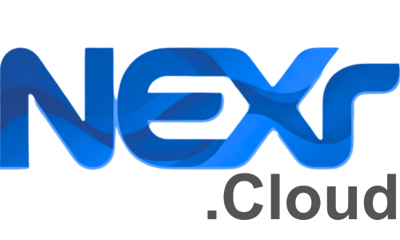

# Open NEXr Modeler
[](LICENSE)
[](https://nextjs.org/)
[](https://www.npmjs.com/package/@nexr-cloud/modeler)
[](https://www.sap.com/products/technology-platform.html)

**Open NEXr Modeler** is a sophisticated, AI-driven architecture designer built for the **SAP Business Technology Platform (BTP)**. It empowers architects to visualize, standardize, and design production-ready cloud architectures with enterprise-grade precision.

---

## 🧩 Powered by @nexr-cloud/modeler

The core rendering engine and architectural logic are powered by our dedicated React component library:
👉 **[@nexr-cloud/modeler](https://www.npmjs.com/package/@nexr-cloud/modeler)**

This modular architecture ensures that while **Open NEXr Modeler** provides the interface and AI integration, the high-fidelity diagram rendering remains lightweight, consistent, and independently verifiable.

---

## 🤝 Building Trust Through Transparency

We believe in winning your trust by sharing our core intelligence with the community. **Open NEXr Modeler** is our commitment to open-source innovation. It serves as an educational and innovative gift for architects exploring the power of AI in cloud design.

---

## ☁️ NEXr Cloud Enterprise

<a href="https://nexr.cloud/"></a>

### **Scale Your Enterprise with NEXr Cloud**
*Deploy intelligent agents that automate complex business operations across SAP, Oracle, and beyond — in weeks, not years.*

👉 **[Visit NEXr Cloud](https://nexr.cloud/)**

---

## 🚀 Key Features

- **AI-Driven Generation**: Describe business requirements in natural language and watch NEXr construct a complete SAP BTP architecture.
- **Bring Your Own Key (BYOK)**: Flexibility to use your own AWS Bedrock or AI providers directly within the app.
- **Interactive Canvas**: High-performance, zoomable, and draggable canvas for exploring complex system designs.
- **Enterprise JSON Export**: Standardized architecture mapping and detailed service connections.
- **SAP Best Practices**: Built-in reference patterns for the entire SAP BTP ecosystem.

---

## 🧠 Tuning & Optimization (System Prompt)

To achieve the best results with your chosen AI model (e.g., Claude 3.5 Sonnet or GPT-4o), you can customize the **System Prompt** within the application:

1. Locate `src/lib/system-prompt.ts`.
2. Tweak the architectural rules and constraints to match your specific organizational standards.
3. For more advanced diagrams, ensure the "Enterprise Connection Density" rules are explicitly defined to encourage the model to generate multi-service interdependencies.

By fine-tuning this prompt, you can direct the AI to prioritize specific cloud layers, security zones, or hybrid integration patterns unique to your enterprise landscape.

---

## 🛠️ Tech Stack

- **Framework**: [Next.js 16+](https://nextjs.org/)
- **Core Modeler**: [@nexr-cloud/modeler](https://www.npmjs.com/package/@nexr-cloud/modeler)
- **UI & Styling**: [Tailwind CSS 4+](https://tailwindcss.com/)
- **AI Integration**: [AI SDK](https://sdk.vercel.ai/)
- **Component System**: [Shadcn/UI](https://ui.shadcn.com/)
- **State Management**: [Zustand](https://zustand-demo.pmnd.rs/)

---

## 🏁 Getting Started

### Prerequisites
- [Bun](https://bun.sh/) or Node.js 18+
- An API Key for your preferred AI Provider (configured in-app)

### Installation

1. **Clone & Install**:
   ```bash
   git clone https://github.com/nexr-cloud/open-modeler.git
   cd open-modeler
   bun install
   ```

2. **Run Dev Server**:
   ```bash
   bun dev
   ```

3. **Configure AI**:
   Open [http://localhost:3000](http://localhost:3000), go to **Settings**, and enter your AI Provider credentials directly in the UI. No environment variables required!

## 📄 License

This project is licensed under the Apache License 2.0 - see the [LICENSE](LICENSE) file for details.

---

Built with ❤️ by the **NEXr Cloud** team. Empowering the **SAP Ecosystem** through AI.
